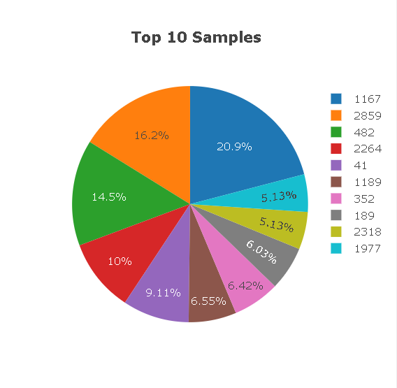
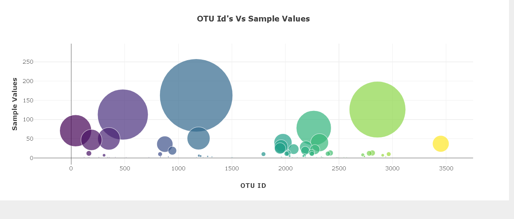
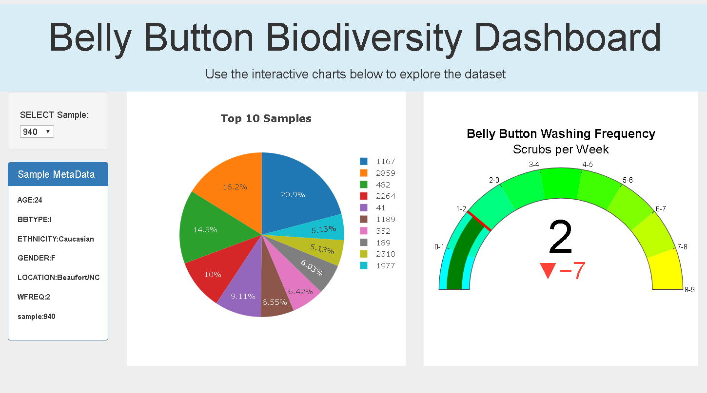
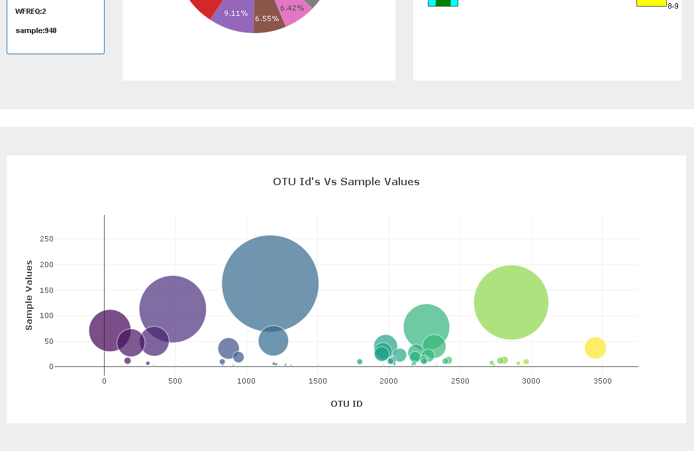
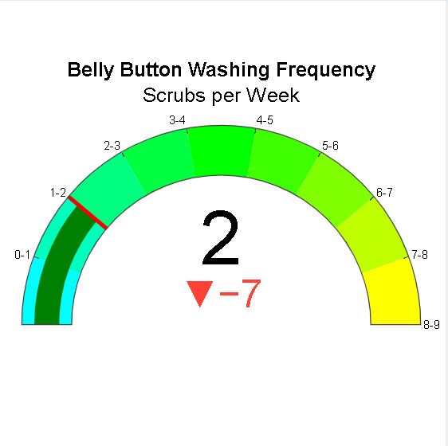
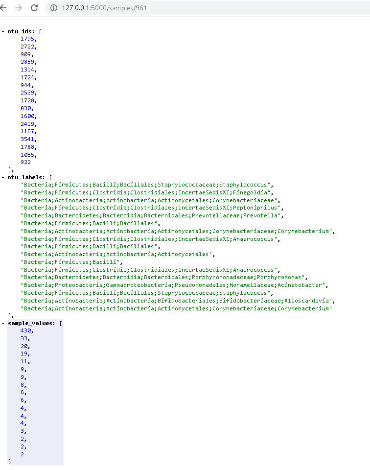
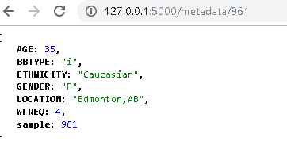

# Belly Button Biodiversity

In this challenge, I have built an interactive dashboard to explore the [Belly Button Biodiversity DataSet](http://robdunnlab.com/projects/belly-button-biodiversity/).

## Step 1 - Plotly.js

Used Plotly.js to build interactive charts for this dashboard.

* Created a PIE chart that uses data from samples route (`/samples/<sample>`) to display the top 10 samples.

  

* Created a Bubble Chart that uses data from samples route (`/samples/<sample>`) to display each sample.

  

* Dashboard

## Step 2 - Heroku

Deployed the  Flask app to [Heroku](https://belly-button-dash-app.herokuapp.com/).

- - -

## Advanced Challenge Assignment (Optional)

* Gauge Chart to plot the Weekly Washing Frequency obtained from the `/metadata/<sample>`route.

- - -

## Flask API

Use Flask API starter code to serve the data needed for your plots.

* Tested different routes.

1. /samples/<sample>

2. /metadata/<sample>

